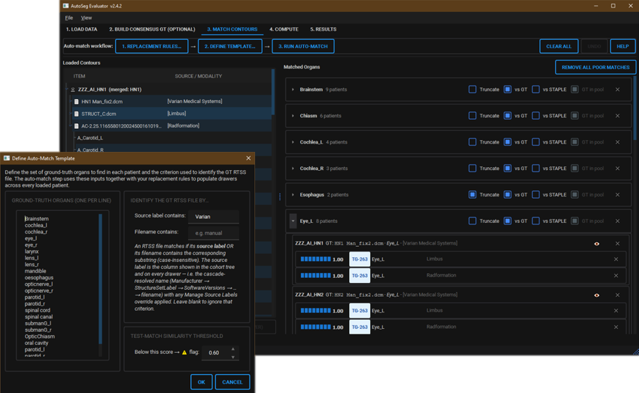

# AutoSeg Evaluator

<p align="center">
  
</p>

> A GUI tool for segmentation quality assessment in radiotherapy.

[](https://github.com/MLCOOKER/AutoSeg-Evaluator/actions/workflows/ci.yml)
[](LICENSE)
[](https://www.python.org/downloads/)


Created by Branimir Rusanov

AutoSeg Evaluator is a Python desktop application that computes segmentation
quality metrics from DICOM image, RT Structure Set (RTSS), and RT Dose files.
It is designed for clinicians, medical physicists, and researchers performing
commissioning, ongoing QA, comparative evaluation of auto-contouring systems,
or inter-observer variability studies in radiotherapy — without requiring
command-line or coding expertise.

## Features

- **Two ways of measuring geometry, side by side**:
  - *3D mask metrics* — Dice, precision and recall, 3D Hausdorff 100% / 95%,
    Mean Surface Distance, Surface Dice (configurable tolerance), centre-of-mass
    offset, signed volume difference and volume ratio, computed on binary masks;
    the surface metrics with Google DeepMind's
    [`surface-distance`](https://github.com/google-deepmind/surface-distance).
  - *2D contour metrics* — Added Path Length and normalised APL (both
    directions), 2D Hausdorff 100% / 95%, mean and median contour distance,
    measured on the RTSTRUCT outlines themselves with no rasterisation, to the
    definitions of Boukerroui et al. (2023). A metric that cannot be defined is
    reported with its reason, never as a zero.
- **One reading of every contour**: both streams read a structure's loops into
  regions by the same rules — holes, islands and touching loops as drawn,
  declared `CLOSEDPLANAR_XOR` as declared — and refuse, with a stated reason,
  the loops that have no single reading. A difference between a 2D and a 3D
  number is therefore a difference in measurement, never in what the contour
  was taken to be.
- **Dosimetric metrics**: each structure's DVH, with the RT Dose integrated
  over the contours themselves — read by the same rules as the geometric
  metrics, with exact partial areas, sampled every 0.25 mm (coarser only for
  the largest targets, and once per voxel for a body contour) — giving Dmin / Dmean / Dmax plus user-defined
  `D{X}_gy` (dose to the hottest X%), `D{X}cc_gy` and `V{X}gy_cc` (volume
  receiving ≥ X Gy) points.
- **STAPLE consensus**: Simultaneous Truth and Performance Level Estimation
  (Warfield 2004) with per-rater sensitivity / specificity plus consensus
  uncertainty metrics (uncertain-band volume, mean entropy, rater
  disagreement, rater volume range), surfaced in the results table as a
  dedicated **STAPLE Details** row. Results are tagged by mode —
  *Multi-observer STAPLE* (Tab 2 consensus), *Generic STAPLE with GT* and
  *Generic STAPLE no GT* (Tab 3 per-drawer) — and every test contour scored
  against a consensus GT also carries its own sensitivity / specificity.
- **Multi-observer consensus ground truth**: assign each manual observer a
  distinct source label in Tab 1, select which labels are observers, and
  build a per-patient STAPLE consensus from them. The consensus is written
  back as a synthetic RTSS and flows into the evaluation pipeline as the
  designated ground truth — editable organ groupings, an unmatched tray for
  manual re-assignment, and an independent fuzzy-match threshold per patient.
- **Inter-observer variability**: pairwise 3D mask metrics (Dice, Hausdorff,
  surface distances, volume, centre of mass) over the selected observers, with
  configurable metric selection and tolerance override.
- **Qualitative (Likert) assessment**: score each contour on the 5-point
  MD Anderson scale through a fast review UI — a multiplanar viewer (axial /
  coronal / sagittal, zoom, window/level, contour opacity + thickness),
  per-grader configuration (blinded vs transparent,
  include-GT, randomize), multiple graders, and session resume. Scores land in
  per-grader `Likert` columns in the Results table.
- **Contour visualiser**: Match Contours opens any patient's ground truth and
  matched contours in the same multiplanar viewer as the Qualitative tab, and
  when an RT Dose is loaded it can overlay the planned dose as a colour wash
  (jet, Gy) with an opacity control and scale.
- **Statistics and report**: the Report tab compares sources organ by organ on
  paired cases — Wilcoxon signed-rank with an exact p-value, a Hodges–Lehmann
  estimate with its confidence set, and the rank-biserial effect size — with
  forest, paired and distribution figures, an acquisition summary built from an
  allowlist of non-identifying tags, and export to a PDF report. Every design
  decision is recorded, with worked examples, in
  [`docs/V3_REPORT_STATISTICS_REGISTER.md`](docs/V3_REPORT_STATISTICS_REGISTER.md).
- **Canonical organ grouping**: the many spellings of one organ are grouped so
  statistics can pool them, without ever pooling two organs — laterality is
  extracted rather than fuzzy-matched, and a fuzzy match is only a proposal.
- **Audit record**: optionally, an export is accompanied by a `.audit.json`
  holding the detail behind every number — both directions of each distance,
  what each stream measured over, how each contour was read, the rasteriser and
  the 2D engine with their settings.
- **Smart auto-matching**: hybrid Levenshtein + cosine matcher backed by a
  TG-263 synonym dictionary (~17 000 variants from the official worksheet),
  user-defined replacement rules, and template-driven batch selection.
- **Robust DICOM linking**: resolves each structure set to the image series it
  was contoured on and to its dose from the explicit UID references inside the
  DICOM files (`ReferencedFrameOfReferenceSequence` → `RTReferencedSeriesSequence`,
  and the dose's own `ReferencedStructureSetSequence`), falling back to
  `FrameOfReferenceUID` only when those are absent. No RTPLAN required. Where
  two candidates are equally good — a re-irradiation course, a replan, a
  composite dose — the ambiguity is reported and settled by the user in Tab 1
  rather than silently guessed.
- **Source identification**: cascading fallback (Manufacturer →
  StructureSetLabel → SoftwareVersions → filename) handles in-house models
  that lack metadata, with a manual override dialog persisted in
  `settings.json`. Six raw DICOM identification columns plus assisted
  propagation let you disambiguate two RTSSes from the same vendor — e.g.
  giving each manual observer a distinct label for consensus building.
- **Modern UI**: 7-tab workflow with accordion organ drawers, colourblind-safe
  similarity indicators, banded results table, dark / light themes, full undo
  stack on Match Contours.
- **Save / load sessions**: resume curated multi-patient evaluations across
  sittings; session schema is versioned and forward-compatible.
- **Portable**: ships as a hospital-IT-friendly Python bundle (see below) —
  every dependency is a normal `.py` / `.pyd` file, no PyInstaller blob.

<p align="center">
  
  <br>
  <em>Match Contours: define an organ template and replacement rules, then auto-match contours into per-organ drawers.</em>
</p>

## Quick start

### For end users — portable bundle (recommended)

1. Download the latest `AutoSegEvaluator-v*.zip` from the
   [Releases](https://github.com/MLCOOKER/AutoSeg-Evaluator/releases) page.
2. Extract it anywhere — local folder, USB stick, or shared drive.
3. Double-click `Run AutoSeg Evaluator.bat`.

The bundle ships a self-contained CPython 3.11 runtime and every dependency
as inspectable files under `python\Lib\site-packages\`. No Python install,
no admin rights, no registry writes, no internet access required at runtime —
suited to locked-down clinical Windows environments.

### From source (Windows)

```powershell
git clone https://github.com/MLCOOKER/AutoSeg-Evaluator.git
cd AutoSeg-Evaluator
python -m venv .venv
.venv\Scripts\Activate.ps1
pip install -e ".[dev]"
python -m autoseg_evaluator
```

Python 3.10 or newer required.

### From source (macOS)

```bash
# Python 3.11 via Homebrew (or python.org installer, or pyenv)
brew install python@3.11

git clone https://github.com/MLCOOKER/AutoSeg-Evaluator.git
cd AutoSeg-Evaluator
python3.11 -m venv .venv
source .venv/bin/activate
pip install -e ".[dev]"
python -m autoseg_evaluator
```

PySide6's macOS wheels are self-contained — no extra OS-level Qt
dependencies needed.

### From source (Linux — Ubuntu / Debian)

PySide6's Qt platform plugin links against system C libraries; install
them first, then proceed as on macOS:

```bash
sudo apt update
sudo apt install -y python3.11 python3.11-venv python3-pip git \
    libegl1 libxkbcommon0 libdbus-1-3 libxcb-cursor0 \
    libxcb-icccm4 libxcb-image0 libxcb-keysyms1 libxcb-randr0 \
    libxcb-render-util0 libxcb-shape0 libxcb-sync1 libxcb-xfixes0 \
    libxcb-xinerama0 libxkbcommon-x11-0 libxcb-xkb1

git clone https://github.com/MLCOOKER/AutoSeg-Evaluator.git
cd AutoSeg-Evaluator
python3.11 -m venv .venv
source .venv/bin/activate
pip install -e ".[dev]"
python -m autoseg_evaluator
```

For Fedora / RHEL use:
```bash
sudo dnf install -y python3.11 python3-pip git \
    libxkbcommon mesa-libEGL dbus-libs xcb-util-cursor \
    xcb-util-image xcb-util-keysyms xcb-util-renderutil xcb-util-wm
```

For Arch:
```bash
sudo pacman -S python git qt6-base libxkbcommon-x11
```

The full test suite is exercised on `windows-latest` and `ubuntu-latest` in CI
on every push — macOS is not in CI, but the same PySide6 / SimpleITK / pydicom
stack ships official wheels for macOS so the app is expected to run identically
there. The 2D contour metrics' compiled engine ships for Windows and is built
and validated in CI for Linux; on any other platform the portable reference
engine runs instead, and the Compute tab says which.

### Building the portable bundle locally

```bash
python scripts/build_portable.py
```

Produces `dist/AutoSegEvaluator-v{version}/` and a matching `.zip`. The same
script runs on a `windows-latest` GitHub Actions runner whenever a `v*` tag
is pushed (see [`.github/workflows/release.yml`](.github/workflows/release.yml)).

## Workflow overview

The application is organised into seven sequential tabs:

1. **Load Data** — point at a folder of DICOM data; the app recursively scans
   and groups by patient, study, and frame-of-reference, and links each
   structure set to its image series and dose. Any link it cannot settle from
   the DICOM references is listed for you to decide before computing. Source
   labels can be overridden per RTSS via *Manage Source Labels*.
2. **Build Consensus GT** *(optional)* — pick which source labels are your
   manual observers (each observer = one distinct label), review the
   auto-clustered per-organ groupings for each eligible patient, compute
   inter-observer variability metrics, and generate a STAPLE-derived
   synthetic ground-truth RTSS per patient that flows into Tab 3.
3. **Match Contours** — define replacement rules and an organ template, then
   run auto-match to populate accordion drawers grouped by organ. Per-drawer
   toggles control truncation, vs-GT vs vs-STAPLE mode, and whether the
   designated GT is fed into the STAPLE expectation-maximisation step.
   *Label Organs* sets the organ each drawer is reported under in the
   statistics, and each patient's *Visualize* button opens its contours on the
   CT.
4. **Qualitative Assessment** *(optional)* — score each contour on the 5-point
   MD Anderson Likert scale in a fast review UI (multiplanar viewer, swipe,
   per-grader blinded/transparent + include-GT + randomize configuration,
   multiple graders). Scores flow into the Results table.
5. **Compute** — choose 3D mask metrics and 2D contour metrics in two groups
   side by side, each with its own tolerance, plus dosimetric metrics; then run
   with detailed live progress and cancel. *Metric definitions…* explains
   exactly how every metric is computed, and *Record audit detail* keeps the
   detail behind every number for export.
6. **Results** — review the banded metrics table (tolerance values baked into
   the headers, 2D and 3D columns distinguished) and export to CSV, with the
   audit record beside it when one was kept.
7. **Report** — pick a ground truth, a metric and a comparison, and read the
   per-organ statistics, figures and acquisition summary; export the page as a
   PDF report.

See [`docs/PROJECT_OVERVIEW.md`](docs/PROJECT_OVERVIEW.md) for the full
architecture reference covering the matching pipeline, data linking, how
contours are read and filled, every metric implementation, STAPLE algorithm
details, the statistics, session schema, performance engineering, and a
literature index. [`docs/V3_RELEASE_STATUS.md`](docs/V3_RELEASE_STATUS.md)
records what v3.0.0 contains and which numbers it moves.

## Validation

Every numerical engine in AutoSeg Evaluator is checked against an upstream
reference implementation or published values:

- **Mask rasterisation** — the default `continuous` backend fills the regions
  of [the shared contour reading](docs/PROJECT_OVERVIEW.md#reading-the-contours-both-streams)
  with a half-open rule. It is voxel-identical to dcmrtstruct2nii v5's
  `DcmPatientCoords2Mask` engine except where a voxel centre lies exactly on
  an outline edge, which it assigns to one side so shapes keep their true
  area. It measures analytic disc phantoms to within ~2 % for structures ≥10
  voxels in radius. The opt-in `legacy` backend remains 110 / 110 ROIs
  voxel-identical to PlatiPy 0.7.2's `transform_point_set_from_dicom_struct`;
  it snaps contour vertices to the voxel grid before filling and therefore
  over-estimates volume by roughly `1.5 / R` (R = structure radius in voxels)
  — ~3 % for large organs, >50 % for structures one to two voxels across; see
  [`docs/RASTERISER_COMPARISON.md`](docs/RASTERISER_COMPARISON.md).
- **3D mask metrics** — Dice, HD100, HD95, Surface Dice @ 3 mm and mean
  surface distance produce zero absolute difference vs
  `google-deepmind/surface-distance` (Nikolov et al. 2018) on every
  ROI–metric comparison of a clinical head-and-neck sample dataset.
- **2D contour metrics** — both engines reproduce the published values of
  Boukerroui et al. (2023) on all 150 synthetic pairs through this
  application's own call path, and the default compiled engine does so from
  the DICOM files themselves too, with a largest error of ~5e-10 mm against a
  0.001 mm threshold; 44 stress cases behave as specified. See
  [`docs/POLYGON_VALIDATION_REPORT.md`](docs/POLYGON_VALIDATION_REPORT.md).
- **Contour reading** — on a 70-structure-set head-and-neck cohort (5,166
  structures), the shared reading gave regions identical to the 2D engine
  supplier's own parser on all 5,143 structures both read, and every one of
  the 22,123 voxels it changed in the 3D masks had its centre exactly on an
  outline edge (`scripts/validate_contour_reading.py`).
- **STAPLE consensus** — 55 / 55 multi-rater consensus computations
  bit-identical to a direct `SimpleITK.STAPLEImageFilter` invocation
  (Warfield et al. 2004): every per-rater sensitivity/specificity matched
  to zero, every binary consensus voxel-identical.
- **DVH** — against the analytic datasets of Nelms et al. (Med Phys 2015,
  42:4435), no dose-volume parameter is more than 3 % off with contours every
  0.2 mm (0 / 260) and 10 / 195 are with 1–3 mm contours and dose grids,
  against 5 and 18 for PlanIQ and 32 and 53 for Pinnacle³ in the paper; on 576
  analytic disc phantoms the worst dose error is 0.11 Gy in a 1 Gy/mm gradient.
  The dicompyler-core DVH of earlier versions, scored the same way, reported
  D99 as 0 Gy in 49 of the 100 Nelms cases.

The full per-ROI breakdowns are in
[`docs/VALIDATION_REPORT.md`](docs/VALIDATION_REPORT.md) (masks + 3D metrics;
generated at v2.3.2, when it also covered the since-removed mask APL),
[`docs/POLYGON_VALIDATION_REPORT.md`](docs/POLYGON_VALIDATION_REPORT.md),
[`docs/STAPLE_VALIDATION_REPORT.md`](docs/STAPLE_VALIDATION_REPORT.md), and
[`docs/DVH_METHOD_VALIDATION.md`](docs/DVH_METHOD_VALIDATION.md). Each report
is auto-generated by a script under [`scripts/`](scripts/) and contains no
PHI (no DICOM UIDs, filenames, patient identifiers, dates, or institution
metadata — only anonymised ROI display names and numeric values). Anyone can
re-run the validators against their own data to verify the parity claims
independently:

```bash
python scripts/validate_against_upstream.py        --data <CT+RTSS folder>          --out docs/VALIDATION_REPORT.md
python scripts/validate_polygon_metrics.py         --data <published archives>      --out docs/POLYGON_VALIDATION_REPORT.md
python scripts/validate_contour_reading.py         <folder of CT+RTSS>
python scripts/validate_staple_against_upstream.py --data <CT+multi-RTSS folder>    --out docs/STAPLE_VALIDATION_REPORT.md
python scripts/validate_dvh_methods.py             --nelms <Nelms et al. data>      --out docs/DVH_METHOD_VALIDATION.md
```

The DVH benchmark needs the `validation` extra (`pip install .[validation]`)
and the Nelms et al. datasets, which are the paper's supplementary material.

The equivalences are locked in CI via `tests/test_platipy_equivalence.py`,
`tests/test_metrics_equivalence.py`, `tests/test_rasteriser_backends.py`,
`tests/test_contour_reading.py`, the 2D engines' own acceptance suites under
`tests/vendor/`, `tests/test_staple_equivalence.py`, and `tests/test_dvh.py`
(the DVH against answers known exactly).

> **v3 moves numbers.** Results from v3 are not directly comparable with v1 or
> v2: the default rasteriser changed, the half-open fill moves masks whose
> outlines run through voxel centres, and mask-based APL is removed in favour
> of the 2D contour APL. See [`CHANGELOG.md`](CHANGELOG.md).

## Citation

If you use AutoSeg Evaluator in your research, please cite:

> Rusanov B *AutoSeg
> Evaluator: An Efficient GUI Tool for Segmentation Quality Assessment.*


## License

Apache License 2.0 — see [LICENSE](LICENSE).

## Contributing

Contributions are welcome. Please see [CONTRIBUTING.md](CONTRIBUTING.md) for
guidance.

## Acknowledgements

This project incorporates ideas and validated implementations from
[PlatiPy](https://github.com/pyplati/platipy),
[google-deepmind/surface-distance](https://github.com/google-deepmind/surface-distance),
and [dcmrtstruct2nii](https://github.com/Sikerdebaard/dcmrtstruct2nii).
Versions before 3.0 computed DVHs with
[dicompyler-core](https://github.com/dicompyler/dicompyler-core), which the DVH
benchmark still scores alongside; the benchmark itself is the analytic datasets
of Nelms, Stambaugh, Hunt, Tonner, Zhang and Feygelman, *Methods, software and
datasets to verify DVH calculations against analytical values: twenty years
late(r)*, Medical Physics 42 (2015) 4435. The 2D
contour metrics implement the definitions of Boukerroui, Vasquez Osorio,
Brunenberg & Gooding, *Analytic calculations and synthetic shapes for
validation of quantitative contour comparison software*, Physics and Imaging in
Radiation Oncology 26 (2023) 100436; the supplied engines, their provenance and
licences are in [`third_party/native_contour_metrics/`](third_party/native_contour_metrics/).
