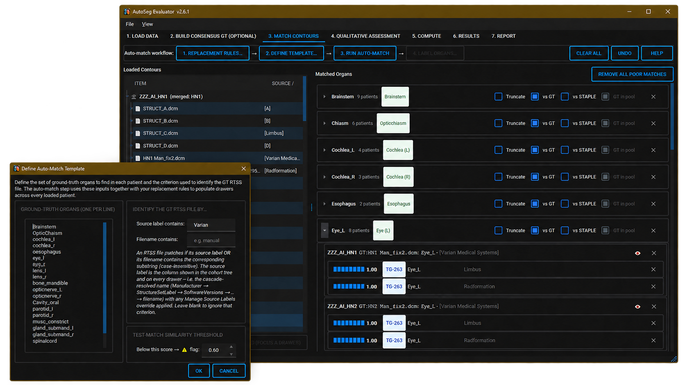
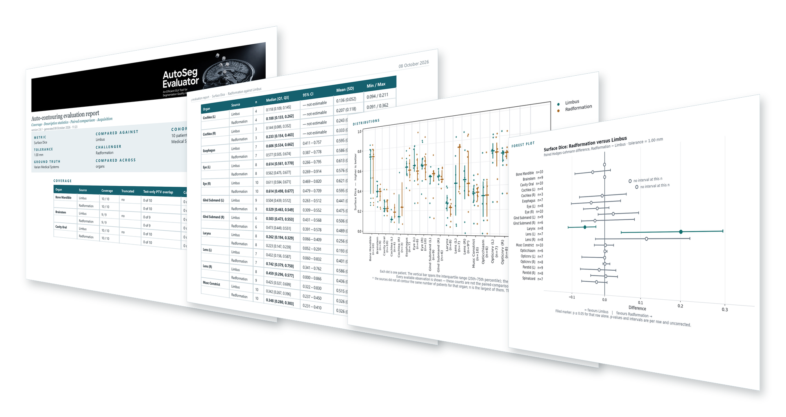

# AutoSeg Evaluator

<p align="center">
  
</p>

> A GUI tool for segmentation quality assessment in radiotherapy.

[](https://github.com/MLCOOKER/AutoSeg-Evaluator/actions/workflows/ci.yml)
[](LICENSE)
[](https://www.python.org/downloads/)


Created by Branimir Rusanov

AutoSeg Evaluator is a Python desktop application that computes segmentation
quality metrics from DICOM image, RT Structure Set (RTSS), and RT Dose files.
It is designed for clinicians, medical physicists, and researchers performing
commissioning, ongoing QA, comparative evaluation of auto-contouring systems,
or inter-observer variability studies in radiotherapy — without requiring
command-line or coding expertise.

## Features

**Two views of contour geometry** — 3D metrics on binary masks (Dice,
Hausdorff, surface Dice, precision and recall) beside 2D metrics measured on
the contours as stored, including added path length.

**Dose metrics** — DVH points such as D95%, D2cc and V20Gy, integrated over
each structure's own contours.

**Automatic matching** — contours from every vendor and observer are paired by
organ, using a TG-263 synonym dictionary of about 17,000 spellings plus your
own rules.

**STAPLE consensus** — build a ground truth from several observers, score
contours against a consensus of the whole pool, and measure inter-observer
variability.

**Statistics and a PDF report** — paired comparisons organ by organ, with
forest, paired and distribution plots, exported as a PDF report.

**Qualitative review** — blinded or transparent Likert grading by several
graders, in a multiplanar viewer.

**Contour checks** — every run flags test contours that reach into the PTV
where the ground truth does not, and contours that skip a slice.

**DICOM linking without an RT Plan** — images, structure sets and dose are
matched by their own references; anything ambiguous is flagged, not guessed.

**Validated** — each metric is checked against reference software or analytical
shapes; the reports are in [`docs/validation`](docs/validation/).

**Portable** — download, extract and run on Windows or Linux, with no
installation and no administrator rights.

Every metric, setting and design decision is described in
[`docs/PROJECT_OVERVIEW.md`](docs/PROJECT_OVERVIEW.md).

<p align="center">
  
  <br>
  <em>Match Contours: define an organ template and replacement rules, then auto-match contours into per-organ drawers.</em>
</p>

<p align="center">
  
  <br>
  <em>An exported report: coverage, descriptive statistics, distributions and a forest plot for one metric.</em>
</p>

## Quick start

### For end users — portable bundle (recommended)

**Windows 10 / 11 (64-bit)**

1. Download the latest `AutoSegEvaluator-v*.zip` from the
   [Releases](https://github.com/MLCOOKER/AutoSeg-Evaluator/releases) page.
2. Extract it to a folder with a short path, such as `C:\AutoSegEvaluator`
   — on a local disk, a USB stick or a shared drive. Windows limits a file's
   full path to 260 characters and the bundle's files sit deep inside it, so
   from a deeper folder the app cannot start (it says so); the `README.txt`
   inside gives the longest folder path that works.
3. Double-click `Run AutoSeg Evaluator.bat`.

**Linux (x86-64)**

1. Download the latest `AutoSegEvaluator-v*-linux-x86_64.tar.gz` from the
   same page.
2. Extract it somewhere you can write to: `tar -xzf AutoSegEvaluator-v*-linux-x86_64.tar.gz`.
3. Run `./run-autoseg-evaluator.sh` inside it. Optionally,
   `./add-to-applications-menu.sh` adds it, with its icon, to your
   applications menu.

The `README.txt` inside states the oldest glibc the bundle needs, which comes
from the PySide6 release it was built with (glibc 2.34 for PySide6 6.11:
Ubuntu 22.04, Debian 12, RHEL / Rocky / AlmaLinux 9 or later).

Each bundle ships a self-contained CPython 3.11 runtime and every dependency
as inspectable files under `site-packages`. No Python install, no admin
rights, no registry writes, no internet access required at runtime — suited
to locked-down clinical environments. Both include the validated compiled
engine for the 2D contour metrics.

### From source (Windows)

```powershell
git clone https://github.com/MLCOOKER/AutoSeg-Evaluator.git
cd AutoSeg-Evaluator
python -m venv .venv
.venv\Scripts\Activate.ps1
pip install -e ".[dev]"
python -m autoseg_evaluator
```

Python 3.10 or newer required.

### From source (macOS)

```bash
# Python 3.11 via Homebrew (or python.org installer, or pyenv)
brew install python@3.11

git clone https://github.com/MLCOOKER/AutoSeg-Evaluator.git
cd AutoSeg-Evaluator
python3.11 -m venv .venv
source .venv/bin/activate
pip install -e ".[dev]"
python -m autoseg_evaluator
```

PySide6's macOS wheels are self-contained — no extra OS-level Qt
dependencies needed.

### From source (Linux — Ubuntu / Debian)

PySide6's Qt platform plugin links against system C libraries; install
them first, then proceed as on macOS:

```bash
sudo apt update
sudo apt install -y python3.11 python3.11-venv python3-pip git \
    libegl1 libxkbcommon0 libdbus-1-3 libxcb-cursor0 \
    libxcb-icccm4 libxcb-image0 libxcb-keysyms1 libxcb-randr0 \
    libxcb-render-util0 libxcb-shape0 libxcb-sync1 libxcb-xfixes0 \
    libxcb-xinerama0 libxkbcommon-x11-0 libxcb-xkb1

git clone https://github.com/MLCOOKER/AutoSeg-Evaluator.git
cd AutoSeg-Evaluator
python3.11 -m venv .venv
source .venv/bin/activate
pip install -e ".[dev]"
python -m autoseg_evaluator
```

For Fedora / RHEL use:
```bash
sudo dnf install -y python3.11 python3-pip git \
    libxkbcommon mesa-libEGL dbus-libs xcb-util-cursor \
    xcb-util-image xcb-util-keysyms xcb-util-renderutil xcb-util-wm
```

For Arch:
```bash
sudo pacman -S python git qt6-base libxkbcommon-x11
```

The full test suite is exercised on `windows-latest` and `ubuntu-latest` in CI
on every push — macOS is not in CI, but the same PySide6 / SimpleITK / pydicom
stack ships official wheels for macOS so the app is expected to run identically
there. The 2D contour metrics' compiled engine ships for Windows and Linux
x86-64, validated with the suppliers' acceptance suites (the Linux record is in
[`third_party/native_contour_metrics/builds/linux-x86_64/`](third_party/native_contour_metrics/builds/linux-x86_64/));
on any other platform the portable reference engine runs instead, and the
Compute tab says which.

### Building the portable bundle locally

```bash
python scripts/build_portable.py
```

Builds for the platform it runs on. On Windows it produces
`dist/AutoSegEvaluator-v{version}/` and a matching `.zip`; on Linux,
`dist/AutoSegEvaluator-v{version}-linux-x86_64/` and a matching `.tar.gz`. The
same script runs on `windows-latest` and `ubuntu-22.04` GitHub Actions runners
whenever a `v*` tag is pushed, and each bundle is started and checked before it
is attached to the release (see
[`.github/workflows/release.yml`](.github/workflows/release.yml) and
[`scripts/smoke_test_bundle.py`](scripts/smoke_test_bundle.py)).

## Workflow overview

The application is organised into seven sequential tabs:

1. **Load Data** — point at a folder of DICOM data; the app recursively scans
   and groups by patient, study, and frame-of-reference, and links each
   structure set to its image series and dose. Any link it cannot settle from
   the DICOM references is listed for you to decide before computing. Source
   labels can be overridden per RTSS via *Manage Source Labels*.
2. **Build Consensus GT** *(optional)* — pick which source labels are your
   manual observers (each observer = one distinct label), review the
   auto-clustered per-organ groupings for each eligible patient, compute
   inter-observer variability metrics, and generate a STAPLE-derived
   synthetic ground-truth RTSS per patient that flows into Tab 3.
3. **Match Contours** — define replacement rules and an organ template, then
   run auto-match to populate accordion drawers grouped by organ. Per-drawer
   toggles control truncation, vs-GT vs vs-STAPLE mode, and whether the
   designated GT is fed into the STAPLE expectation-maximisation step.
   *Label Organs* sets the organ each drawer is reported under in the
   statistics, and each patient's *Visualize* button opens its contours on the
   CT.
4. **Qualitative Assessment** *(optional)* — score each contour on the 5-point
   MD Anderson Likert scale in a fast review UI (multiplanar viewer, swipe,
   per-grader blinded/transparent + include-GT + randomize configuration,
   multiple graders). Scores flow into the Results table, each with the time it
   was given, and scoring can continue over several sessions.
5. **Compute** — choose 3D mask metrics and 2D contour metrics in two groups
   side by side, each with its own tolerance — or several, computed in the same
   run — plus dosimetric metrics; then run with detailed live progress and
   cancel. One computation fills the results table; computing again replaces
   it, after asking. *Metric definitions…* explains exactly how every metric is
   computed, and *Record audit detail* keeps the detail behind every number for
   export.
6. **Results** — review the banded metrics table (one column per tolerance,
   named with it; 2D and 3D columns distinguished; when each row was computed)
   and export to CSV, with the audit record beside it when one was kept. Saving
   the session keeps the table, so it need not be computed again.
7. **Report** — pick a ground truth, a metric and a comparison, and read the
   per-organ statistics, figures and acquisition summary; export the page as a
   PDF report.

See [`docs/PROJECT_OVERVIEW.md`](docs/PROJECT_OVERVIEW.md) for the full
architecture reference covering the matching pipeline, data linking, how
contours are read and filled, every metric implementation, STAPLE algorithm
details, the statistics, session schema, performance engineering, and a
literature index. [`docs/V3_RELEASE_STATUS.md`](docs/V3_RELEASE_STATUS.md)
records what v3.0.0 contains and which numbers it moves.

## Validation

Every numerical engine in AutoSeg Evaluator is checked against an upstream
reference implementation or published values:

- **Mask rasterisation** — the default `continuous` backend fills the regions
  of [the shared contour reading](docs/PROJECT_OVERVIEW.md#reading-the-contours-both-streams)
  with a half-open rule. It is voxel-identical to dcmrtstruct2nii v5's
  `DcmPatientCoords2Mask` engine except where a voxel centre lies exactly on
  an outline edge, which it assigns to one side so shapes keep their true
  area. It measures analytic disc phantoms to within ~2 % for structures ≥10
  voxels in radius. The opt-in `legacy` backend remains 110 / 110 ROIs
  voxel-identical to PlatiPy 0.7.2's `transform_point_set_from_dicom_struct`;
  it snaps contour vertices to the voxel grid before filling and therefore
  over-estimates volume by roughly `1.5 / R` (R = structure radius in voxels)
  — ~3 % for large organs, >50 % for structures one to two voxels across.
  Scored in the authors' synthetic benchmark beside six converters (108
  configurations, 14 shape families, error = area gained plus area lost
  against the stored polygon), the default backend converts all 1,512 cases,
  XOR contours included, and on the 176 cases every converter shares its error
  is 22.46 %, level with the best converter (Plastimatch, 22.47 %) and against
  19.12 % for the attainable optimum; see
  [Supplementary 2](docs/validation/Supplementary_2_Binary_Mask_Rasteriser_Validation_Report.md).
- **3D mask metrics** — Dice, HD100, HD95, Surface Dice @ 3 mm and mean
  surface distance produce zero absolute difference vs
  `google-deepmind/surface-distance` (Nikolov et al. 2018) on every
  ROI–metric comparison of a clinical head-and-neck sample dataset. On 1,000
  synthetic mask pairs at seven voxel spacings, anisotropic ones included,
  the embedded port and the application's whole metric path are identical to
  the package bit for bit: every per-element distance and area, Hausdorff at
  five percentiles, both directional means and Surface Dice at six tolerances;
  see [Supplementary 4](docs/validation/Supplementary_4_Google-deepmind_surface-distance_Implementation.md).
- **2D contour metrics** — both engines reproduce the published values of
  Boukerroui et al. (2023) on all 150 synthetic pairs through this
  application's own call path, and the default compiled engine does so from
  the DICOM files themselves too, with a largest error of ~5e-10 mm against a
  0.001 mm threshold; 44 stress cases behave as specified. See
  [`docs/archive/POLYGON_VALIDATION_REPORT.md`](docs/archive/POLYGON_VALIDATION_REPORT.md).
  Against the ideal analytical shapes themselves, distances differ by at most
  0.058 mm on the coarse grid and 0.008 mm on the fine one, all of it the
  stored circles' own polygonal approximation; against the authors' own
  software, by at most 0.013 mm, inside its sampling step. See
  [Supplementary 3](docs/validation/Supplementary_3_2D_Polygon_Metric_Validation_Report.md).
- **Contour reading** — on a 70-structure-set head-and-neck cohort (5,166
  structures), the shared reading gave regions identical to the 2D engine
  supplier's own parser on all 5,143 structures both read, and every one of
  the 22,123 voxels it changed in the 3D masks had its centre exactly on an
  outline edge (`scripts/validate_contour_reading.py`).
- **STAPLE consensus** — 55 / 55 multi-rater consensus computations
  bit-identical to a direct `SimpleITK.STAPLEImageFilter` invocation
  (Warfield et al. 2004): every per-rater sensitivity/specificity matched
  to zero, every binary consensus voxel-identical. All 55 are also identical
  to SimpleITK run on its own defaults, which set no iteration limit: STAPLE
  converges in 2–151 iterations, inside the application's cap of 500. See
  [Supplementary 5](docs/validation/Supplementary_5_STAPLE_Implementation.md).
- **DVH** — against the analytic datasets of Nelms et al. (Med Phys 2015,
  42:4435), no dose-volume parameter is more than 3 % off with contours every
  0.2 mm (0 / 260) and 10 / 195 are with 1–3 mm contours and dose grids,
  against 5 and 18 for PlanIQ and 32 and 53 for Pinnacle³ in the paper; on 576
  analytic disc phantoms the worst dose error is 0.11 Gy in a 1 Gy/mm gradient.
  The dicompyler-core DVH of earlier versions, scored the same way, reported
  D99 as 0 Gy in 49 of the 100 Nelms cases. A structure that exists only as a
  mask (a STAPLE consensus) is sampled over its voxels instead; for the same
  Nelms structure its Dmean is within 0.12 % of the contours' on the dataset's
  0.6 mm CT, and within 2.2 % on a 1.37 mm CT, where its volume differs by up
  to 9.4 %. Contours compared against a consensus still take their dose from
  their contours: the consensus's mask error is then common to every source and
  cancels between them, while taking each contour from its own mask too adds an
  independent error for any contour that does not coincide with the consensus.
  See [Supplementary 1](docs/validation/Supplementary_1_DVH_Validation_Report.md).

The supplementary validation reports, each a short report with a full-results
file holding every table behind it, are listed in
[`docs/validation`](docs/validation/README.md). Reports from earlier
versions are in [`docs/archive`](docs/archive/README.md). Each report is
auto-generated by a script under [`scripts/`](scripts/) and contains no PHI (no
DICOM UIDs, filenames, patient identifiers, dates, or institution metadata —
only anonymised ROI display names and numeric values). Anyone can re-run the
validators against their own data to verify the parity claims independently:

```bash
python scripts/validate_dvh_methods.py             --nelms <Nelms et al. data>      # Supplementary 1, part A
python scripts/validate_dvh_mask_vs_polygon.py     --nelms <Nelms et al. data>      # Supplementary 1, part B
python scripts/validate_rasterisation_fidelity.py  --study <benchmark>/project --clinical <CT+RTSS folder>  # Supplementary 2
python scripts/validate_polygon_analytic.py        --data <Boukerroui et al. data>  # Supplementary 3
python scripts/validate_surface_distance_equivalence.py                             # Supplementary 4
python scripts/validate_staple_against_upstream.py --data <CT+multi-RTSS folder>    # Supplementary 5
python scripts/validate_contour_reading.py         <folder of CT+RTSS>
```

The DVH benchmark needs the `validation` extra (`pip install .[validation]`)
and the Nelms et al. datasets, which are the paper's supplementary material.

The equivalences are locked in CI via `tests/test_platipy_equivalence.py`,
`tests/test_metrics_equivalence.py`, `tests/test_rasteriser_backends.py`,
`tests/test_contour_reading.py`, the 2D engines' own acceptance suites under
`tests/vendor/`, `tests/test_staple_equivalence.py`, and `tests/test_dvh.py`
(the DVH against answers known exactly).

> **v3 moves numbers.** Results from v3 are not directly comparable with v1 or
> v2: the default rasteriser changed, the half-open fill moves masks whose
> outlines run through voxel centres, and mask-based APL is removed in favour
> of the 2D contour APL. See [`CHANGELOG.md`](CHANGELOG.md).

## Citation

If you use AutoSeg Evaluator in your research, please cite:

> Rusanov B *AutoSeg
> Evaluator: An Efficient GUI Tool for Segmentation Quality Assessment.*


## License

Apache License 2.0 — see [LICENSE](LICENSE).

## Contributing

Contributions are welcome. Please see [CONTRIBUTING.md](CONTRIBUTING.md) for
guidance.

## Acknowledgements

This project incorporates ideas and validated implementations from
[PlatiPy](https://github.com/pyplati/platipy),
[google-deepmind/surface-distance](https://github.com/google-deepmind/surface-distance),
and [dcmrtstruct2nii](https://github.com/Sikerdebaard/dcmrtstruct2nii).
Versions before 3.0 computed DVHs with
[dicompyler-core](https://github.com/dicompyler/dicompyler-core), which the DVH
benchmark still scores alongside; the benchmark itself is the analytic datasets
of Nelms, Stambaugh, Hunt, Tonner, Zhang and Feygelman, *Methods, software and
datasets to verify DVH calculations against analytical values: twenty years
late(r)*, Medical Physics 42 (2015) 4435. The 2D
contour metrics implement the definitions of Boukerroui, Vasquez Osorio,
Brunenberg & Gooding, *Analytic calculations and synthetic shapes for
validation of quantitative contour comparison software*, Physics and Imaging in
Radiation Oncology 26 (2023) 100436; the supplied engines, their provenance and
licences are in [`third_party/native_contour_metrics/`](third_party/native_contour_metrics/).
